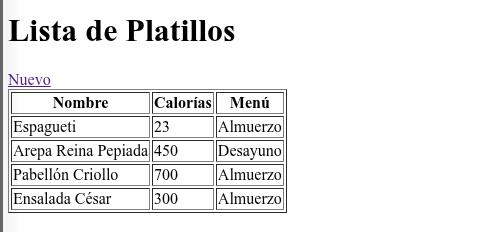
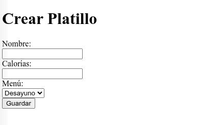

# Evaluación 2 - Paradigmas de Programación

**Universidad Politécnica Territorial del Estado Aragua “Federico Brito Figueroa”**
**Carrera:** Informática 2
**Asignatura:** Paradigmas de Programación
**Profesor:** Elías Vargas

## Integrantes
- Eduardo Rodriguez
- Evelys Peñaloza

## Enunciado Asignado
**Enunciado 8: Restaurante** (Relación: Menú -> Platillos)

## Visualización de la Aplicación

Aquí puedes ver cómo luce el sistema de gestión de platillos:

## Instrucciones de Ejecución
Para correr el proyecto localmente, siga estos pasos:

1. Clonar el repositorio.
2. Instalar dependencias: `composer install`
3. Crear archivo .env: `cp .env.example .env`
4. Configurar la conexión a la base de datos en el archivo `.env` (`DB_DATABASE`, `DB_USERNAME`, `DB_PASSWORD`).
5. Generar key de la aplicación: `php artisan key:generate`
6. Ejecutar migraciones y seeders: `php artisan migrate --seed`
7. Iniciar servidor: `php artisan serve`
